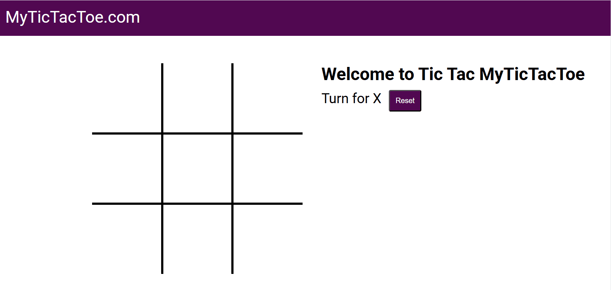

# TicTacTeo Game
A user friendly and responsive TicTacTeo Game built using Html,Css and JavaScript. 
## Live Demo
[Click here to try the calculator!](https://github.com/hannanmehboob/TicTacTeo)

## Preview

## Features
- Grid Display (3x3)
- Two Players (X and O)
- Turn-Based Play
- Win Detection (row, column, diagonal)
- Draw Detection
- Responsive design
- Clear button to reset the Game

Do Feel free to use it to learn and also suggestion for any improvement you could give, :) 
